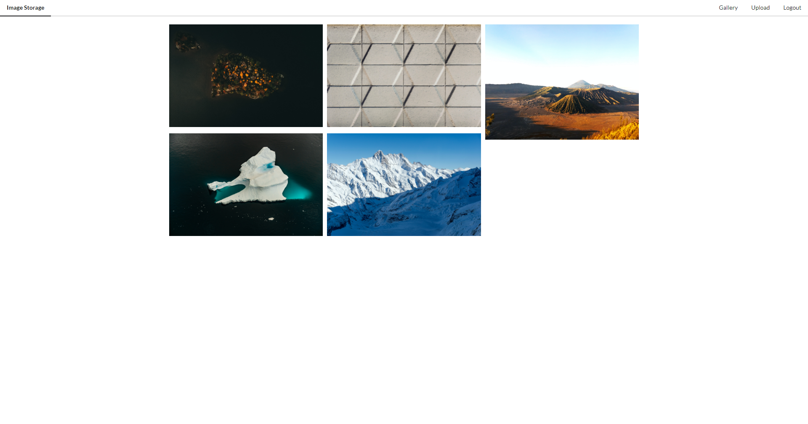

# Vue-Images

<div style="display: flex;">
  
</div>

## Introduction

This project's initial purpose was to test and learn Vue. The project was implemented following the [Udemy course: Vue JS Essentials with Vuex and Vue Router](https://www.udemy.com/course/vue-js-course/learn/lecture/10231064?start=0#overview).

The project was also used as an example project to teach TAMK's students how GitLab CI and GitHub Actions work during TIKO-päivät, which was organized by Tampere University of Applied Science's student club: [SYNTAKSI Ry](https://tamko.fi/students-union/sub-associations/clubs/#syntaksi)

## About the app

The app is a simple gallery app, which uses [Imgur's](https://imgur.com/) API to auth the user and to store the images to Imgur. The app has GitHub Actions and GitLab CI/CD configuration to deploy the app automatically to Heroku (currently not deployed).

## Technologies
- Vue (2)
- Vuex
- Axios
  - HTTP Client
- Lodash
  - Utilities

## Project setup
```
yarn install
```

### Compiles and hot-reloads for development
```
yarn serve
```

### Compiles and minifies for production
```
yarn build
```

### Lints and fixes files
```
yarn lint
```

### Customize configuration
See [Configuration Reference](https://cli.vuejs.org/config/).
